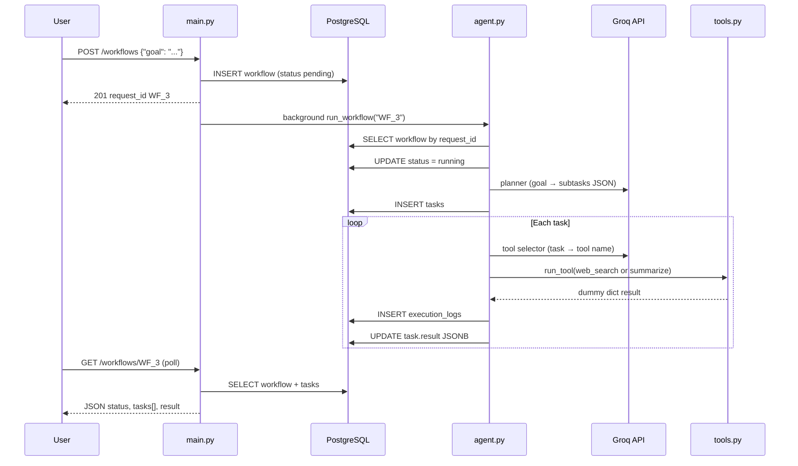
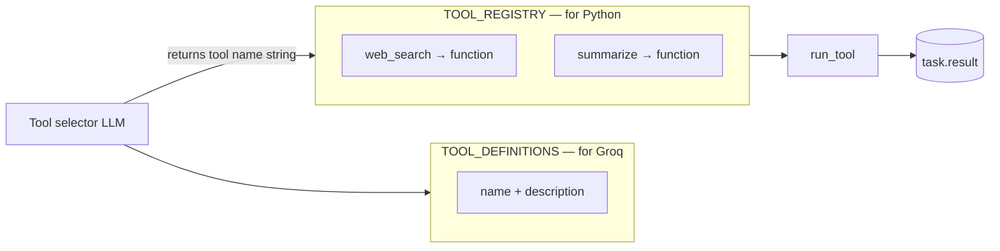
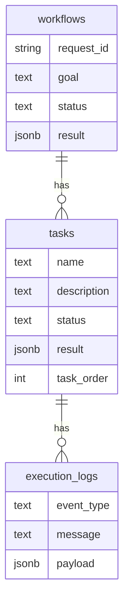

# agentFlow — Beginner guide (concepts + code map)

Read this **away from the code** first. Use it when `agent.py` feels overwhelming: find your question in the glossary or diagram, then open **one** file.

---

## 1. The whole story in one picture



**Takeaway:** `main.py` only starts the job. `agent.py` does the slow work **after** the user already got `request_id`. The UI learns progress by **polling GET**, not by waiting on POST.

---

## 2. Which file answers which question?

| Question | Open this file |
|----------|----------------|
| How does the user submit a goal? | `backend/main.py` → `create_workflow` |
| Who runs the AI pipeline? | `backend/agent.py` → `run_workflow` |
| What tools exist and how are they called? | `backend/tools.py` |
| How do we connect to Postgres? | `backend/database.py` |
| What tables/columns exist? | `backend/models.py` + `database/table_creation.sql` |
| What JSON does the API send/receive? | `backend/schema.py` |

**Reading order for agent code:** `main.py` (POST only) → `agent.py` (`run_workflow` only) → `tools.py` → ignore the rest until you need it.

---

## 3. `run_workflow` in plain English (no syntax)

Function: `run_workflow(request_id)` — e.g. `"WF_3"`.

| Step | What happens |
|------|----------------|
| 0 | Open a database session (like a short conversation with Postgres). |
| 0 | Find the workflow row for this `request_id`. Missing → error. |
| 0 | Set workflow `status` to **running**, save (so GET shows it). |
| 1 | Send `workflow.goal` to **Groq #1** (planner) → list of subtasks. |
| 1 | Insert one **tasks** row per subtask. Save. |
| 2 | For **each** task: **Groq #2** picks a tool name. |
| 2 | Call the Python function for that tool (dummy data for now). |
| 2 | Write logs + save `task.result`. Save. |
| end | Close the database session. |

Workflow stays **running** today; marking **completed** is a later step.

---

## 4. Structures and words we use (glossary)

### Python basics used everywhere

| Term | Plain meaning | In agentFlow |
|------|----------------|--------------|
| **function** | Named recipe: input → output | `run_workflow`, `web_search` |
| **dict** | Labeled box: `{"key": value}` | Groq JSON, `task.result`, tool output |
| **list** | Ordered list `[a, b, c]` | List of tasks from planner; `tasks[]` in API |
| **str** | Text | `goal`, `request_id`, tool name |
| **None** | “Empty / not set yet” | `result` before anything runs |

Example dict (tool output):

```json
{
  "tool": "web_search",
  "query": "Find AI startups",
  "results": [{ "title": "...", "snippet": "..." }]
}
```

---

### Database words

| Term | Plain meaning | In agentFlow |
|------|----------------|--------------|
| **Postgres** | Database server storing rows | `workflows`, `tasks`, `execution_logs` |
| **Session** | One conversation with DB for a stretch of code | `SessionLocal()` in agent; `get_db()` in routes |
| **commit** | “Save my changes for real” | After `running`, after tasks, after tools |
| **rollback** | “Undo since last commit” | On error in `run_workflow` |
| **query** | Ask DB for rows | `db.query(Workflow).filter(...).first()` |
| **ORM** | Python classes that mirror tables | `Workflow`, `Task` in `models.py` |
| **JSONB** | JSON stored inside Postgres | `workflows.result`, `tasks.result` |

**Session vs `get_db`:** Routes use `Depends(get_db)` so FastAPI opens/closes the session. Background `run_workflow` must open and close the session **itself** (same idea, manual wiring).

---

### API / FastAPI words

| Term | Plain meaning | In agentFlow |
|------|----------------|--------------|
| **route** | URL + method (GET/POST) | `POST /workflows` |
| **request body** | JSON the client sends | `{"goal": "..."}` |
| **response** | JSON the server returns | `WorkflowResponse` |
| **Pydantic** | Checks JSON shape before your code runs | `WorkflowCreate`, `WorkflowResponse` in `schema.py` |
| **Background task** | Work that runs **after** HTTP response is sent | `background_tasks.add_task(run_workflow, ...)` |
| **poll** | Client calls GET again and again | `GET /workflows/WF_3` |

---

### AI / Groq words

| Term | Plain meaning | In agentFlow |
|------|----------------|--------------|
| **Groq** | Hosted LLM API (fast inference) | `GROQ_API_KEY` in `.env` |
| **Planner** | LLM splits goal into subtasks | `plan_subtasks()` — Groq call #1 |
| **Tool selector** | LLM picks which tool fits a task | `select_tool_for_task()` — Groq call #2 per task |
| **system prompt** | Instructions to the model | `PLANNER_SYSTEM`, `TOOL_SELECTOR_SYSTEM` |
| **temperature** | How random answers are (lower = steadier) | `0.2` planner, `0.1` tool picker |

---

### Tool system (registry + catalog)

Two structures in `tools.py` — **same tool names**, different jobs:



| Name | Type | Who uses it | Purpose |
|------|------|-------------|---------|
| **TOOL_DEFINITIONS** | `list` of `dict` | Groq (in prompt) | Menu: what each tool is *for* |
| **TOOL_REGISTRY** | `dict` name → **function** | Python `run_tool()` | Kitchen: run the code |
| **get_tools()** | returns `(catalog, registry)` | `agent.py` | Copy both for planner loop |
| **run_tool()** | function | `agent.py` | Lookup name in registry, call function, return dict |

**Why a registry?** Groq only returns text like `"web_search"`. Python needs to **find and call** `web_search(...)`. The registry is that lookup table.

**Rule:** Every `name` in `TOOL_DEFINITIONS` must match a key in `TOOL_REGISTRY` exactly.

---

### Data shapes through the pipeline

| Stage | Shape | Example |
|-------|--------|---------|
| User input | plain text | `Research AI startups` |
| POST body | JSON dict | `{"goal": "Research..."}` |
| After Pydantic | Python `str` | validated `goal` |
| In DB `workflows` | columns | `goal` TEXT, `status` TEXT |
| Planner output | list of dicts | `[{"name": "...", "description": "...", "task_order": 1}]` |
| Tool selector output | dict | `{"tool": "web_search"}` |
| Stored on task | JSONB dict | `{"selected_tool": "web_search", "tool_output": {...}}` |
| GET response | JSON | `WorkflowResponse` → JSON in browser |

---

## 5. Database tables (what gets written when)



| When | Table | What changes |
|------|--------|----------------|
| POST | `workflows` | New row, `pending`, goal saved |
| Agent start | `workflows` | `status` → `running` |
| After planner | `tasks` | New rows per subtask |
| Per task | `execution_logs` | `tool_selection`, `tool_run` |
| Per task | `tasks` | `result` JSON with tool output |

---

## 6. How to read code without panic

1. Read **section comments** and this doc — not every line.
2. Pick **one function** (start with `run_workflow`).
3. Translate each block to one English sentence (see section 3).
4. Max **three** unknown words per session; look them up in section 4.
5. Run POST + GET + pgAdmin once so code has a real picture.

**Safe to skip for now:** regex in JSON parsers, CORS, `temperature`, type hints like `dict[str, Any]`, the `if`/`elif` at the end of `run_tool` (we can unify later with one `context` argument).

---

## 7. Debug prints (IN/OUT in the terminal)

Set in `.env` (optional):

```env
AGENTFLOW_DEBUG=1
```

Use `0` to turn off all `[DEBUG]` lines.

1. Run `uvicorn backend.main:app --reload`
2. POST `/workflows` from `/docs`
3. Watch the **terminal** (not the browser response) for blocks like:

| Label | Meaning |
|-------|---------|
| `POST /workflows IN/OUT` | HTTP boundary |
| `run_workflow IN` | Background started with `request_id` |
| `plan_subtasks IN/OUT` | Goal → list of tasks |
| `select_tool_for_task IN/OUT` | Task → tool name |
| `run_tool IN/OUT` | Tool name → dummy dict |
| `task saved to DB` | What went into `task.result` |

---

## 8. Quick test checklist

1. Start API: `uvicorn backend.main:app --reload`
2. `POST http://127.0.0.1:8000/workflows` with body `{"goal": "List three uses of AI in hospitals"}`
3. Note `request_id` in response (e.g. `WF_4`)
4. Wait a few seconds (Groq + DB)
5. `GET http://127.0.0.1:8000/workflows/WF_4`
6. Expect: `status` **running**, `tasks` not empty, each `result` has `selected_tool` and `tool_output`
7. In pgAdmin: rows in `tasks` and `execution_logs` for that workflow

---

## 9. Groq calls (three)

| # | Function | Purpose |
|---|----------|---------|
| 1 | `plan_subtasks` | Goal → subtask list |
| 2 | `select_tool_for_task` | Per task → tool name |
| 3 | `summarize_workflow` | Goal + all task results → `{summary, reasoning}` on `workflows.result` |

When `status` is **completed**, GET returns `result` (summary) and `tasks: []`.

## 10. What is not built yet

- Real web search API (placeholders only)
- Redis queue / separate worker process

---

## 11. Where this doc lives

| Doc | Use |
|-----|-----|
| **This file** | Big picture + glossary + diagrams |
| `backend/agent.py` top comment | Same flow, tied to code file |
| `backend/tools.py` top comment | Registry vs catalog |
| `documents/AGENTIC_AI_LEARNING_GUIDE.md` | Broader AI concepts (if present) |

When you want a **line-by-line** walkthrough of one function, ask in chat: e.g. “Walk through `run_workflow` only.”
